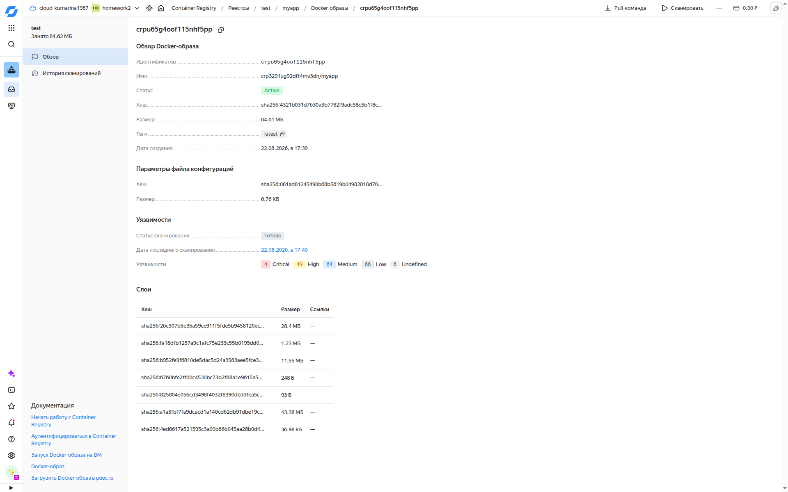
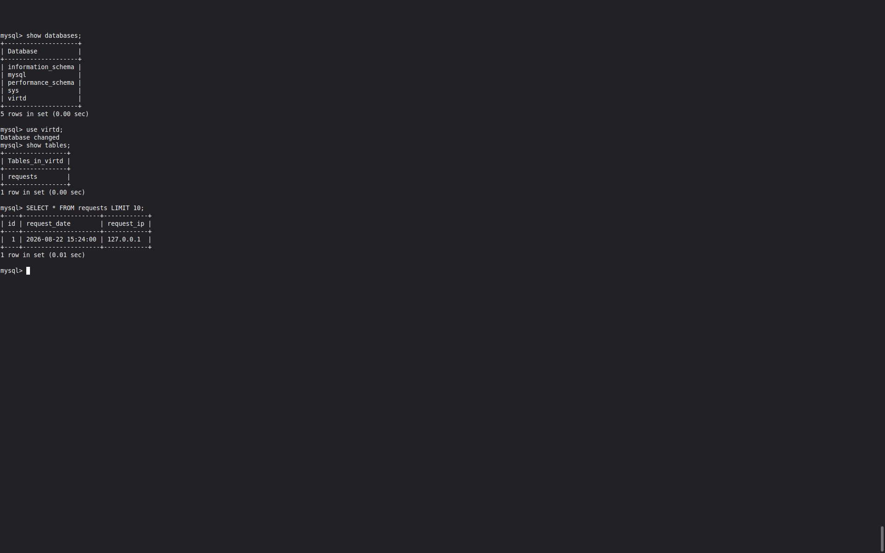
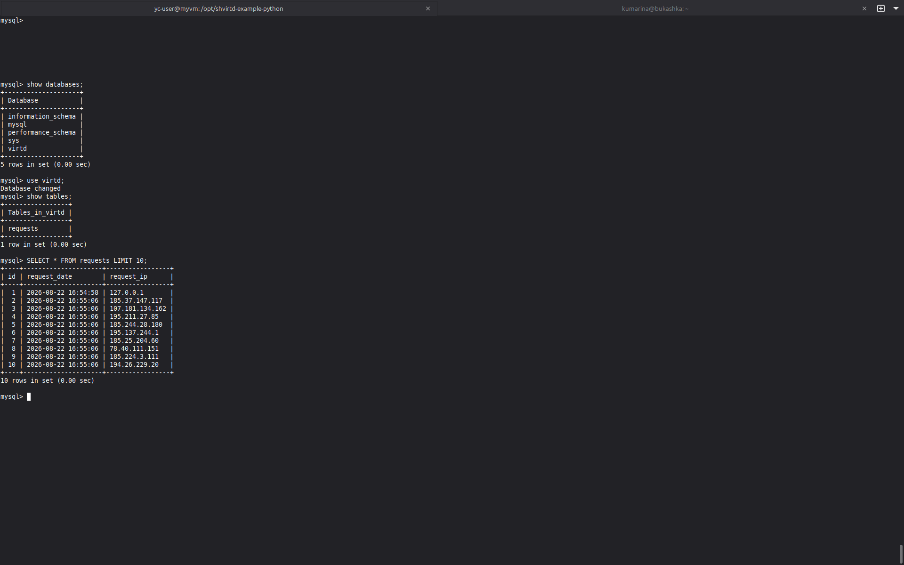
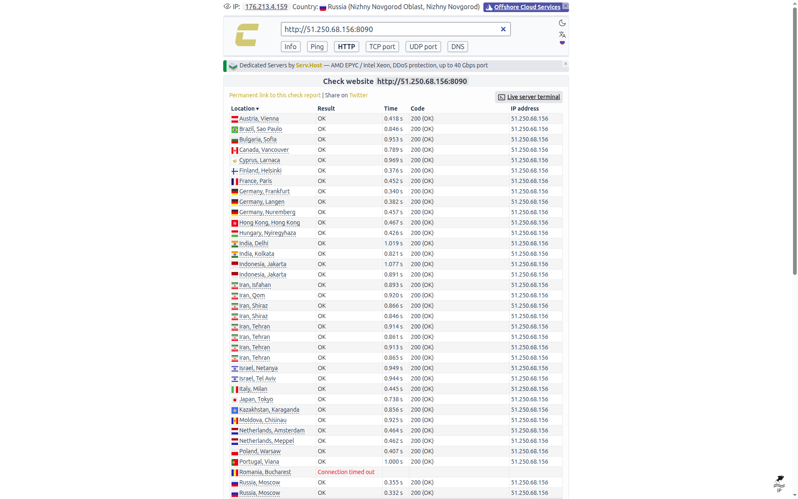

# shvirtd-example-python Кукушкина Марина

### Задание 1 

Файл Dockerfile.python был создан  на основе существующего Dockerfile. Посмотреть его можно по ссылке  https://github.com/kumarina-max/shvirtd-example-python/blob/main/Dockerfile.python 

### Задание 2

#### Отчет сканирования

### Задание 3

#### Скриншот  sql-запроса.

### Задание 4

#### Скриншот  sql-запроса.

#### Проверка вашего сервиса на сайте https://check-host.net/check-http

