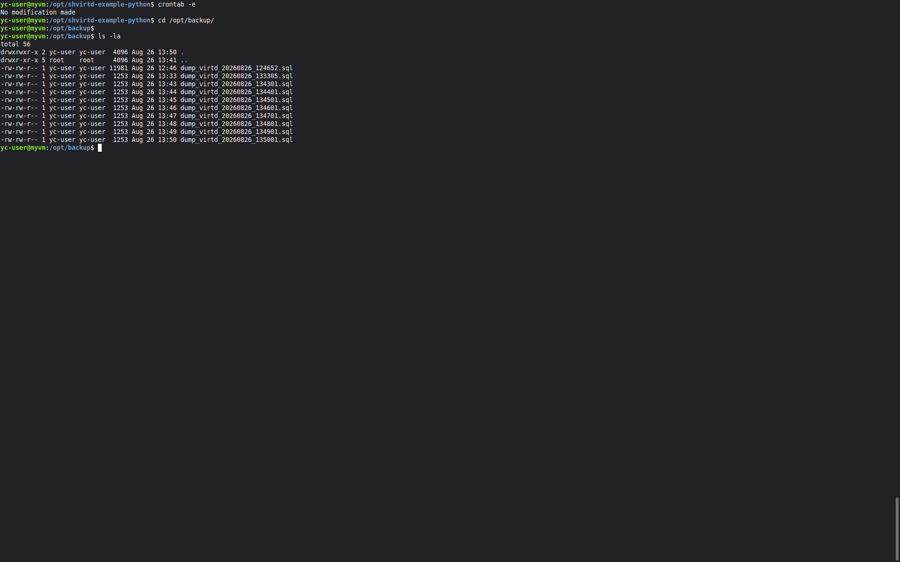

# shvirtd-example-python Кукушкина Марина

### Задание 1 

Файл Dockerfile.python был создан  на основе существующего Dockerfile. Посмотреть его можно по ссылке  https://github.com/kumarina-max/shvirtd-example-python/blob/main/Dockerfile.python 

### Задание 2

#### Отчет сканирования


### Задание 3

#### Скриншот  sql-запроса.


### Задание 4

#### Скриншот  sql-запроса.


#### Проверка сервиса на сайте https://check-host.net/check-http


#### Ссылка на fork:
https://github.com/kumarina-max/shvirtd-example-python 

### Задание 5

#### Содержимое скрипта

```bash
#!/usr/bin/env bash
set -e

PROJECT_DIR="/opt/shvirtd-example-python"
BACKUP_DIR="/opt/backup"
DATE=$(date +%Y%m%d_%H%M%S)

if [ -f "$PROJECT_DIR/.env" ]; then
  export $(grep -v '^#' "$PROJECT_DIR/.env" | xargs)
else
  echo "Ошибка: .env файл не найден!"
  exit 1
fi

docker run --rm \
  --entrypoint "" \
  --network shvirtd-example-python_backend \
  -e MYSQL_PWD="${MYSQL_ROOT_PASSWORD}" \
  -v ${BACKUP_DIR}:/backup \
  schnitzler/mysqldump \
  mysqldump --protocol=tcp --no-tablespaces -h db -uroot ${MYSQL_DATABASE} > ${BACKUP_DIR}/dump_${MYSQL_DATABASE}_${DATE}.sql
```
#### cron-task 


#### Скриншот с несколькими резервными копиями в "/opt/backup"



